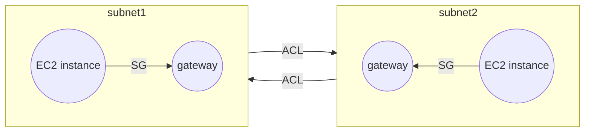
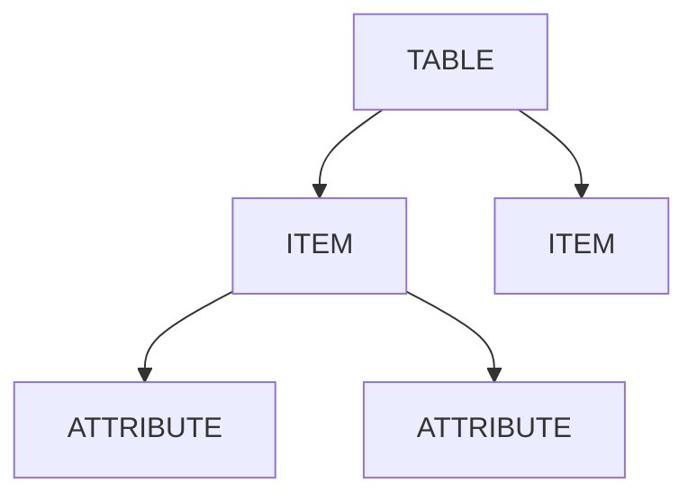
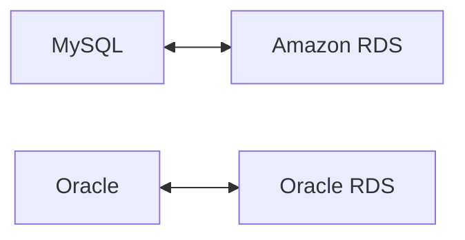
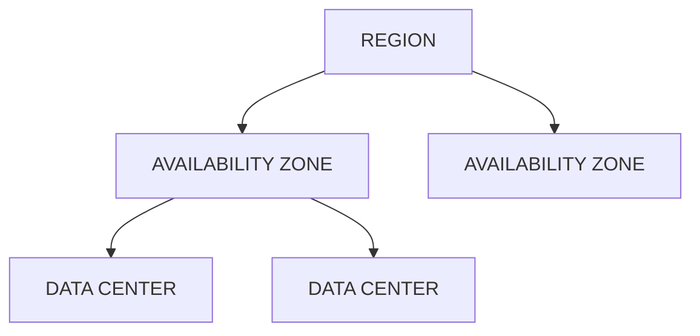

# AWS Services cheatsheet

This cheatsheet provides a list of various services provided by Amazon Web Services.

Services mentioned are based on the notes I made for my AWS Cloud practioner exam.

## EC2: Elastic Compute Cluster
IaaS offering
- Families
  - **General Purpose:** Balanced resource, diverse workloads, webservers, code repos
  - **Compute Optimized:** Compute intensive tasks, game servers, scientific, high performance computing
  - **Memory Optimized:** Processing large data sets in memory
  - **Accelerated Computing:** Floating point calculations, data pattern matching, graphics, used hardware accelerators
  - **Storage Optimized:** High performance for locally stored data
- Pricing
  - **On demand:** No commitment, no bound, billed per second
  - **Savings:** Save upto 72% by 1 or 3 year commitment
  - **Reserved Instances:** Upto 75% savings, suited for predictable steady usage, 1-3 year
  - **Spot Instances:** Upto 90% savings by using spare EC2 instances, 2 minute warning given before shutting down(reclaim period), for flexible (batch) workloads
  - **Dedicated Hosts:** For maintaining compliance, unshared resources
- Features
  - **EC2 autoscaling:** Free feature to add/remove EC2 instances in response to demands.
    - Dynamic scaling responds to demands
    - Predictive scaling auto schedules based on predicted demand

---
---

## ELB: Elastic Load Balancer
- Features
  - Highly Available
  - Auto scalable
  - Other instances just know about 1 ELB handling scale

---
---

## SQS: Simple Queue Service
- Send, receive, store messages at any volume
- Payload protected until delivery

---
---

## SNS: Simple Notification Service
- Send notifications to users
- Uses pub/sub model
- Can create topics, subscribe to topics
- Subscribers can be SQS queue, lambda, webhooks

---
---

### Lambda
FaaS
- Upload code to lambda function
- Configure trigger
- Code run on trigger
- Features
  - Scalable
  - Code run under 15 minutes

---
---

## Containers

### ECS: Elastic Container Service

### EKS: Elastic Kubernetes Service
  - Containers run in isolation in EC2 instance as host

### Fargate
  - Serverless for ECS and EKS

---

EC2 for traditional apps requiring full OS access

Lambda for short running functions, service created apps, event driven apps, apps without server provisioning(serverless)

EKS/ECS for docker containers on managable EC2 instances

Fargate for containers on managed instances

Choosing region:
- Compiance
- Latency
- Feature availability
- Pricing

---
---

### Bracket

Quantum computing

---
---

## Cloudfront
- CDN service
- Features
  - Deliver data, apps and APIs with low latency and high transfer speed
  - Uses edge locations

---
---

## Route 53
- DNS service
- Routing Policies
  - Latency based
  - Geolocation based
  - Geoproximity
  - Weighted round robin

---
---

## Outposts
- Mini AWS region in your data center

---
---

## Elastic Beanstalk
- Quickly deploy and manage apps in EC2 without worrying about infrastructure

---
---

## Cloud Formation
- Infrastucture as Code (IaC)
- Declarative Cloud Formation templates (JSON and YAML)
- Resources like EC2, DB,analytics and ML
- Same template can be run in multiple regions

---
---

## VPC: Virtual Private Cloud
- Logically isolated AWS cloud
- Subnets allow to group resources
- **IGw:** Internet Gateway
  - Allows incoming traffic
- **Virtual Private Gateway**
  - VPN connection between AWS and OnPremise
- **AWS Direct Connect**
  - Dedicated private connection between AWS and on-premises
- **ACL:** Access Control List
  - Every packet crossing boundaries checked against ACLs
  - Stateless
  - Allows both inbound and outbound traffic
- **SG:** Security Group
  - Allow/Deny traffic (like allow HTTPS, deny OS requests)
  - Stateful
  - Does not allows traffic by default



---
---

## Storage

Storage types:
- **Block level storage:** 
  - Files stored in series of blocks 
  - Only updated pieces of block(s) are updated if file update
- **Instance store volumes:**
  - Storage attached to EC2 instance
  - Can be lost in case EC2 host is restarted
  - Restarted EC2 hosts can start with different volume attached

## EBS: Elastic Block Store
 - Virtual hard drives attached to EC2 instances (not tied to EC2 instance)
 - Upto 16 TiB storage, Solid State by default
 - Allows incremental backups(snapshots)

### S3: Simple Storage Service
- Data store
- Features
  - Unlimited amount of data
  - Data stored as objects in buckets, file is a complete object
  - Maximum 5 TB size for object
  - Objects can be versioned
  - Different buckets across regions to limit classes
- Tiers
  - **S3 standard:** For static web hosting, 99.999999999 (Eleven 9s)
  - **S3 IA:** S3 Standard Infrequent Access, for backups or archives
  - **S3 Glacier:** Long storage for audit purpose, direct upload using Lifecycle Policies between tiers

### EFS: Elastic File System

- Managed shared File System
- Accessible by multiple instances at same time
- Autoscalable
- Linux File System
- Regional resource (stored data across multiple Availability Zones)
- Do not require to be in same AZ like EBS
- Unlike EBS, EFS is not attached to EC2 instances

---
---

## Database

AWS supports MySQL, PostreSQL, Oracle and MSSQL Server databases
Databases can be migrated using [Lift and Shift](https://aws.amazon.com/products/storage/lift-and-shift/).

### RDS: Relational Database Service
- Databases
  - Aurora
  - PostgreSQL
  - MySQL
  - MariaDB
  - Oracle DB
  - MSSQL Server
- Supports existing database features and provides auto patch, backups, recovery, failovers, failovers, disatser recovery

### Aurora
- Managed MySQL and PostgreSQL Database
- $\frac{1}{10}$ th cost of commercial database
- Upto 15 read replicas and 6 copies of data
- Continuous S3 backups
- Point in time recovery

### DynamoDB
- Fully managed, serverless, non-relational, NoSQL database
- Data queried using keys, simple, single tabled queries
- $ms$ response time



**Data Warehouses:** Specifically engineered for big, historical analytics instead of operational analysis (real time)

### Redshift
- Data Warehouse as a service
- Multiple PetaBytes nodes
- Query against exabytes of data

### DMS: Data Migration Service
- Migrate existing databases securely and easily
- Source DB is operational during migration to minimize downtime
- Source and target DB not needed of same type
- **Homogenous DB:** Same type

- Source can be on-prem, EC2 or RDS
- Target can be EC2 Database or RDS
- Heterogenous migrations need to convert schema structures and database codes using **AWS Schema Conversion Tool** before DMS conversion

#### Use cases for DMS
- **Dev and Test migrations:** Copy production data to dev or test database
- **Database consolidation:** Combine databases to common database
- **Continuous DB replication**

### Databases use case
- **Dynamo DB:** Key/value pair
- **Document DB:** MongoDB compatibilty
- **Neptune:** Graph database for social networking, recommendation engies, fraud detection
- **QLDB:** Quantum Ledger DataBase, immutable DB

### Amazon Managed Blockchain

### ElastiCache
- Caching layer for Database
- Memcached and Redis flavors

### DAX
- DynamoDB Accelerator
- Native caching layer for DynamoDB reads

---
---

## IAM
- AWS Identity and Access Management
- Allows creating IAM users (no permissions by default)
- IAM policy is used to deny/grant permissions
- JSON document describing if user can/cannot invoke API
```json
{
  "Version": "2012-10-17",
  "Statement": {
    "Effect": "Allow",
    "Action": "s3:ListBucket",
    "Resource": "arn:aws:s3:::coffee_shop_reports"
  }
}
```
- IAM user groups to give permissions to users
- Root users create users
- Roles for temporary access (similar to without any username/password)

### AWS Organizations
- Central location to manage multiple AWS accounts
- Centralized management for all AWS accounts
- Consolidated billing
- Consolidated billing
- Heirarchical account billing
- Access control to services and APIs using **Server Control Policies** applied to individual member accounts and Organizational Unit (OU)

--- 

## Compliance

### AWS Artifact
- Access and review compliance reports done by $3^{rd}$ parties
- Provides access to agreements and reports

### AWS Compliance
- Check all compliance reports in one place

---

## Security

**UDP Flood:** Prevented by security groups allowing proper traffic at AWS network level
**Slowloris attack:** Prevented by ELB waiting until request is completed

**AWS Shield and [AWS WAF](#waf-well-architected-framework)** for advanced security against DDoS attacks

**[DynamoDB](#dynamodb)** employs encryption at rest and is integrated with AWS Key Management Service (AWS KMS)

### Inspector
- Automated security assessment tool to improve security and compliance

### GuardDuty
- Analyze continuous stream of metadata and uses integrated threat intelligence like Machine Learning, IP Address...
- Independant of AWS services

---

## Monitoring
Observing systems, collecting metrics, then using data to make decisions

### Cloudwatch
- Monitor AWS infrastructure and apps in realtime by tracking and monitoring metrics (variables tied to resources)

### Cloudwatch alarm
- Set threshold and trigger alert
- Integrated with SNS

### Cloudwath Dashboard
- List metrics in realtime
- Access all metrics from central location
- Gain visibility into apps, infrastructure and services
- Improve Mean Time to Resolution (MTTR) and Total Cost of Ownership (TCO)

### CloudTrail
- Comprehensive API auditing tool
- Every request to AWS gets logged in CloudTrail engine
- Logs who made the request, which operator, whenm where, IP, response, change, new state, if request was denied

### Trusted Advisor
- Evaluate resources against 5 pillars
  - Cost optimization
  - Performance
  - Security
  - Fault Tolerance
  - Service limits

| Symbol | Explanation |
|---|---|
| ✅ | Number of items detected for no problem |
| ⚠️ | Number of items recommended investigations |
| ❗| Number of recommended actions |

Over 40 concerns around mentioned pillars

---

## Pricing
### Free Tier
- Always free
  - Lambda free for 1 million invocations
- 12 months free
  - S3 free for 12 months for upto 5GB
- Trials
  - Lightsail offers 1 month trial of upto 750 hours usage

Services including free tier:
- SageMaker
- Comprehend Medical
- DynamoDB
- SNS
- Cognito
- (More)


AWS Pricing is based on pay as you go.
Pay less by reserving and volume based discounts.

### Pricing Calculator
- Explore AWS services and create cost estimate for use case
- Cost estimate can be saved and shared

## Billing and Cost Management Dashboard
- Pay bills
- Monitor usage
- Analyze cost
- Compare current month usage with previous month
- View month to date spend by service
- View free tier usage by service
- Cost Explorer and budget creation
- Purchase and manage savings plan
- Publish cost and usage reports

### Consolidated billing
- Combined bill for all AWS account usage and bill the organization instead of account
- Bulk usage discount for combined use
- Reserved resources can be shared across organization
- Simplifies billing
- Share savings
- Free feature

### Budgets
- Set custom budgets for scenarios like cost and usage
- Get proactively notified when exceeding budget
- Found at `Billing` > `Budget` > `Create Budget`

### Cost Explorer
- Visually see and analyze how you are spending money on AWS
- Which services are spending most on
- 12 months historic data
- Grouping by tag is also supported

---

## Support
### Basic Support
- Free for all customers
- 24/7 customer support service
- Documentation
- Whitepapers
- Forums
- AWS Trusted Advisor
- AWS Personal Health Dashboard

### Developer Support
- Basic support
- Email access to customer support
- 12 hour response time

### Business Support
- [Basic Support](#basic-support) + [Developer Support](#developer-support)
- Full set of best practice checks in [Trusted Advisor](#trusted-advisor)
- Phone access to cloud support engineer with 4 hours SLA
- Infrastructure event management for planning massive events

### Enterprise Support
- [Basic Support](#basic-support) + [Developer Support](#developer-support) + [Business Support](#business-support)
- 15 minute SLA for business critical workloads
- Technical Account Manager (TAM) is provided
- TAMs work with customers to review architectures using Well-Architecture Framework
- 5 pillars of [WAF](#waf-well-architected-framework)
  - Operational Excellence
  - Security
  - Reliability
  - Performance Efficiency
  - Cost Optimization

---

## Marketplace
- Digital catalog to find, manage and deploy $3^{rd}$ party software
- One click deployment
- Pay as you go
- [Free tier](#free-tier)
- Quickstart<br>
Enterprise focussed features
- Custom terms and pricing
- Private marketplace
- Cost management tools
- Integration into procurement systems

---

## Adoption
### CAF: Cloud Adoption Framework
- Provide advice to your company for quick and smooth migration to AWS
- Perspectives
  - **Business:** Business or finance analyst 
    - Ensures IT aligns with business needs
  - **People:** HR
    -  Develop organization-wide change management strategy
  - **Governance:** Program Managers
    - Skills and processes to align IT strategy with business strategy
  - **Platform:** Cloud architect
    - Principles and platforms for implementing new solutions on cloud
  - **Security:**
    - Ensures organization meets security objectives for visibility, auditability, control, agility
  - **Operations:**
    - Run, use, operate, recover IT workloads to agreed levels
- [CAF](#caf-cloud-adoption-framework) Action Plan helps guide your organization for cloud migration
- Platform perspective helps design, implement, optimize AWS infrastructure based on business goals

### 6 R's
6 Options for migration
- **Rehosting/Lift and Shift:** No changes to app, just pick up the app and move to AWS
- **Replatforming/Lift, tinker and shift:** Lift and shift with few cloud adoptions and no code change
- **Retire:** Retire apps which are not required
- **Retain:** Apps which are going to be deprecated can deprecate where they live without moving
- **Repurchase:** Abandon legacy software and get a fresh start, example: db vendor to cloud native DB
- **Refactoring:** Change to architecture

### WAF: Well Architected Framework
- Designed to enable architects, developers and users to build secure, high performing resilient and efficient infrastructure
- **Operational excellence:** Running and monitoring systems to deliver business value and improving process and procedures
- **Security:** Checking data integrity
- **Reliability:** Recovery planning
- **Performance efficiency:** IT and computing resource efficiency
- **Cost optimization:** Optimizing full cost 

### Well-Architected Tool
- Accessed via AWS Management console
- Customizable
- - Named workloads
  - Pillars and dropdowns
  - Questions
  - Pillars and question stem
  - Background and recommendation
  - Answer provided and applicability 
  - Resources

---

## Migration

### Snowcone
- 2 CPUs  
  4 GB memory  
  8 TB storage
- 8 TB of data and contain edge computing (EC2 instances and IoT Greengrass)
- Order via AWS management console  
  Copy your data and ship back  
  Data then copied to AWS account usually on S3 buckets
- Newest offering

### Snowball Edge
- Two versions
  - Compute optimized  
    42 TB storage  
    52 vCPU  
    20 GiB memory
  - Storage optimized  
    80 TB  
    40 vCPU  
    80 GiB
- Can fit into existing server racks and clustured
- Once plugged into your infra, can run [lambda](#lambda), [EC2](#ec2-elastic-compute-cluster) compatible AMIs and IoT Greengrass

### Snowmobile
- 100 Petabytes
- Ideal for largest migrations and data center shutdowns
- - Tamper resistant
  - Waterproof
  - Temperature controlled
  - Fire supression
  - GPS tracking
  - 24/7 video surveillance
  - Dedicatged security team 
- Pulled by tracks, 45 foot long shipping container

---

## Baremetal
### VMWare Cloud on AWS
On-premise VMWare instance dropped into AWS

---

## ML/AI
### Sagemaker
Quickly build, train, deploy ML models at scale or build custom models

### Augmented AI(A2I)
ML platform business for building AI

### Amazon Lex
- Ready-to-go AI solutions
- Heart of Alexa
- Helps building chat bots

### Amazon Textract
Extracting text and data from documents

### DeepRacer
Developers to experiment reinforcement learning

---

## Ground Station
Pay as you go satellite service

---
---

# Services

---



```mermaid

flowchart RL
  ec2((EC2))
  elb((ELB))
  sqs((SQS))
  sns((SNS))
  lambda((Lambda))
  ecs((ECS))
  eks((EKS))
  fargate((Fargate))
  bracket((Bracket))
  cloudfront((Cloudfront))
  route53((Route 53))
  outposts((Outposts))
  beanstalk((Elastic Beanstalk))
  cloudformation((Cloud Formation))
  ebs((EBS))
  s3((S3))
  efs((EFS))
  rds((RDS))
  aurora((Aurora))
  dynamodb((DynamoDB))
  redshift((Redshift))
  dms((DMS))
  amazonmanagedblockchain((Amazon Managed Blockchain))
  elasticache((Elasticache))
  dax((DAX))
  organizations((Organizations))
  awsartifact((AWS Artifact))
  awscompliance((AWS Compliance))
  awsshield((AWS Shield))
  waf((WAF))
  inspector((Inspector))
  guardduty((GuardDuty))
  cloudwatch((Cloudwatch))
  cloudwatchalarm((Cloudwatch Alarm))
  cloudwatchdashboard((Cloudwatch Dashboard))
  cloudtrail((CloudTrail))
  trustedadvisor((Trusted Advisor))
  bacmd((Billing and Cost Management Dashboard))
  consolidatedbilling((Consolidated Billing))
  budgets((Budgets))
  costexplorer((Cost Explorer))
  caf((CAF))
  wat((WAT))
  sagemaker((Sagemaker))
  a2i((A2I))
  lex((Amazon Lex))
  textract((Amazon Textract))
  deepracer((DeerRacer))
  groundstation((Ground Station))

  compute[Compute]
  container[Container]
  serverless[Serverless]
  networking[Networking]
  storage[Storage]
  database[Database]
  blockchain[Blockchain]
  iam[IAM]
  compliance[Compliance]
  security[Security]
  monitoring[Monitoring]
  pricing[Pricing]
  migration[Migration]
  mlai[ML/AI]
  satellite[Satellite]

  ec2 --> compute
  
  elb --> compute

  lambda --> compute
  lambda --> container
  lambda --> serverless

  ecs --> compute
  ecs --> container

  eks --> compute
  eks --> container

  fargate --> compute
  fargate --> container
  fargate --> serverless

  bracket --> compute

  cloudfront --> networking

  outposts --> networking

  route53 --> networking

  outposts --> networking

  beanstalk --> serverless

  cloudformation --> compute
  cloudformation --> database

  ebs --> compute
  ebs --> storage

  s3 --> storage

  efs --> storage

  rds --> database

  aurora --> database

  dynamodb --> database

  redshift --> database
  redshift --> storage

  dms --> database
  dms --> storage

  amazonmanagedblockchain --> blockchain
  amazonmanagedblockchain --> storage

  elasticache --> database

  dax --> database

  organizations --> iam

  awsartifact --> compliance

  awscompliance --> compliance

  awsshield --> security

  inspector --> security
  
  guardduty --> security

  cloudwatch --> monitoring
  
  cloudwatchalarm --> monitoring
  
  cloudwatchdashboard --> monitoring
  
  cloudtrail --> monitoring
  
  trustedadvisor --> monitoring

  bacmd --> pricing
  
  consolidatedbilling --> pricing
  
  budgets --> pricing
  
  costexplorer --> pricing

  caf --> migration

  waf --> security
  waf --> migration

  wat --> migration

  sagemaker --> mlai
  a2i --> mlai
  lex --> mlai
  textract --> mlai
  deepracer --> mlai

  groundstation --> satellite

```

## Regions

- Regions made of multiple data centres
- Regions are geographically isolated
- Each availability zone is one or more data centre within a region with redundant power and networking
- Multiple isolated regions within a geographic region
- Best practice to run atleast 2 availability zones

