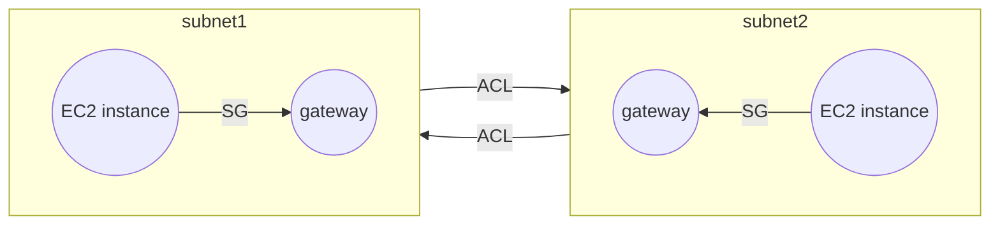
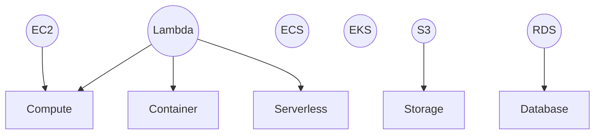

# AWS Services cheatsheet

This cheatsheet provides a list of various services provided by Amazon Web Services.

## Services

- ### EC2: Elastic Compute Cluster
  - Families
    - **General Purpose:** Balanced resource, diverse workloads, webservers, code repos
    - **Compute Optimized:** Compute intensive tasks, game servers, scientific, high performance computing
    - **Memory Optimized:** Processing large data sets in memory
    - **Accelerated Computing:** Floating point calculations, data pattern matching, graphics, used hardware accelerators
    - **Storage Optimized:** High performance for locally stored data
  - Pricing
    - **On demand:** No commitment, no bound, billed per second
    - **Savings:** Save upto 72% by 1 or 3 year commitment
    - **Reserved Instances:** Upto 75% savings, suited for predictable steady usage, 1-3 year
    - **Spot Instances:** Upto 90% savings by using spare EC2 instances, 2 minute warning given before shutting down(reclaim period), for flexible (batch) workloads
    - **Dedicated Hosts:** For maintaining compliance, unshared resources
  - Features
    - **EC2 autoscaling:** Free feature to add/remove EC2 instances in response to demands.
      - Dynamic scaling responds to demands
      - Predictive scaling auto schedules based on predicted demand

- ### Lambda
  - Upload code to lambda function
  - Configure trigger
  - Code run on trigger
  - Features
    - Scalable
    - Code run under 15 minutes

- ### ECS: Elastic Container Service

- ### EKS: Elastic Kubernetes Service
  - Containers run in isolation in EC2 instance as host

- ### Fargate
  - Serverless for ECS and EKS

EC2 for traditional apps requiring full OS access

Lambda for short running functions, service created apps, event driven apps, apps without server provisioning(serverless)

EKS/ECS for docker containers on managable EC2 instances

Fargate for containers on managed instances

---

- ### ELB: Elastic Load Balancer
  - Features
    - Highly Available
    - Auto scalable
    - Other instances just know about 1 ELB handling scale

---

- ### SQS: Simple Queue Service
  - Send, receive, store messages at any volume
  - Payload protected until delivery

---

- ### SNQ: Simple Notification Service
  - Send notifications to users
  - Uses pub/sub model
  - Can create topics, subscribe to topics
  - Subscribers can be SQS queue, lambda, webhooks

---

- ### Bracket
  - Quantun computing

---

- ### Cloudfront
  - CDN service
  - Features
    - Deliver data, apps and APIs with low latency and high transfer speed
    - Uses edge locations

---

- ### Route 53
  - DNS service
  - Routing Policies
    - Latency based
    - Geolocation based
    - Geoproximity
    - Weighted round robin

---

- ### Outposts
  - Mini AWS region in your data center

---

- ### Elastic Beanstalk
  - Quickly deploy and manage apps without worrying about infrastructure

---

- ### Cloud Formation
  - Infrastucture as Code (IaC)
  - Declarative Cloud Formation templates (JSON and YAML)
  - Resources like EC2, DB,analytics and ML
  - Same template can be run in multiple regions

---

- ### VPC: Virtual Private Cloud
  - Logically isolated AWS cloud
  - Subnets allow to group resources
  - **IGw:** Internet Gateway
    - Allows incoming traffic
  - **Virtual Private Gateway**
    - VPN connection between AWS and OnPremise
  - **AWS Direct Connect**
    - Dedicated private connection between AWS and on-premises
  - **ACL:** Access Control List
    - Every packet crossing boundaries checked against ACLs
    - Stateless
    - Allows both inbound and outbound traffic
  - **SG:** Security Group
    - Allow/Deny traffic (like allow HTTPS, deny OS requests)
    - Stateful
    - Does not allows traffic by default

---

- ### EBS: Elastic Block Storage
  - Block level storage
  - Volumes attached to EC2 instances
  - Not tied with any EC2 instance
  - Features
    - Upto 16 TiB storage
    - Solid State by default
    - Allows incremental backups (snapshots)

- ### Instance store
  - Block level storage
  - Disk physically attached to host running EC2
  - Data is not persisted if EC2 instance stops or ends

- ### S3: Simple Storage Service
  - 

